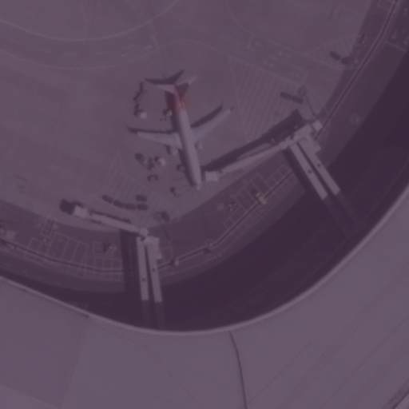
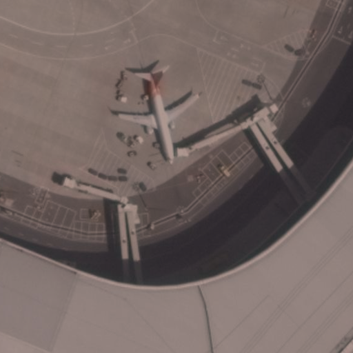
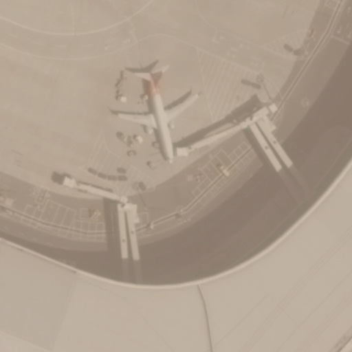
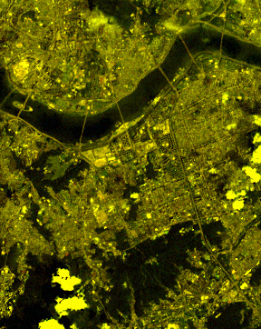
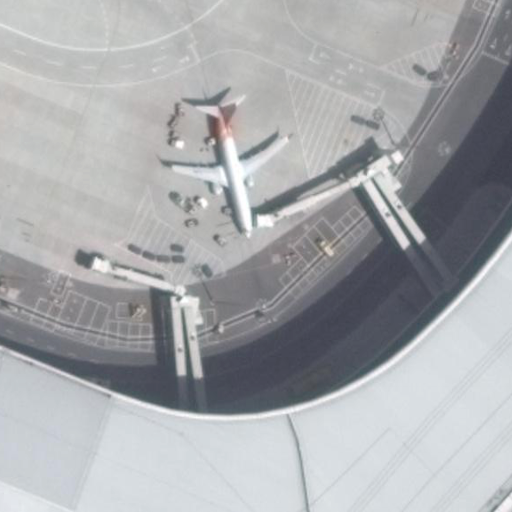
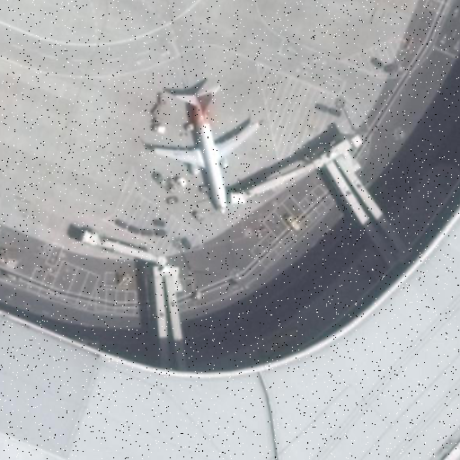
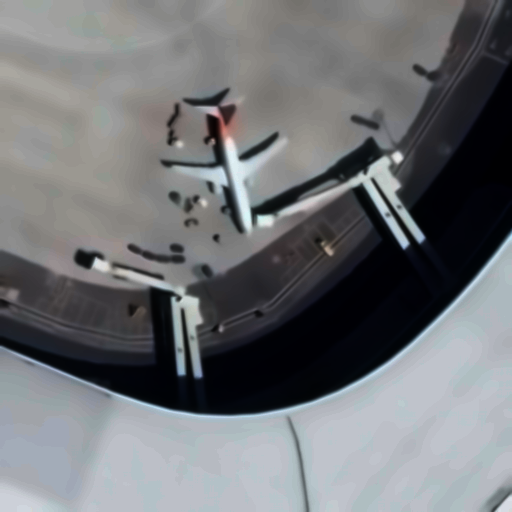
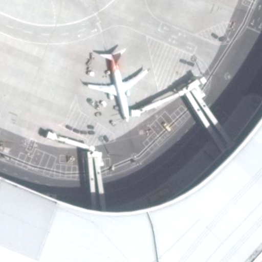
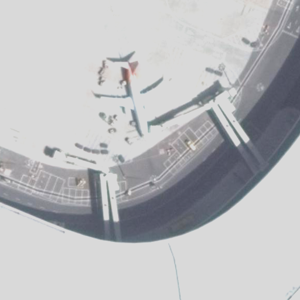
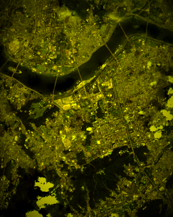

# test_noise
영상 노이즈 생성 도구의 정확성 분석

```bash
pip install -r requirements.txt # 다음 명령어를 통해 의존성을 설치합니다.
conda install -c conda-forge py6s -y # conda 환경이라면 해당 명령어를 통해 설치를 진행합니다.
```


### 하위 모듈 설명

- metadata_sample: 예시 메타데이터 샘플 파일
- noiseGenerator: [Noise Generator 모듈](./test_noise/noiseGenerator/README.md)
- noiseEval: [Noise Evaluator 모듈](./test_noise/noiseEval/README.md)
- denoise: [Denoise 모듈](./test_noise/denoise/README.md)


## 사용 예시 (Usage Examples)

각 모듈의 주요 기능을 사용하는 간단한 예시 코드입니다.

### 1. 노이즈 생성 (Noise Generation)
```python
from test_noise.noiseGenerator import (
    gaussianNoise,
    poissonNoise,
    saltPepperNoise,
    vignettingNoise,
    missingLineNoise,
    atmosphericNoise,
    terrainNoise,
    sunAngleNoise,
    stripingNoise
)
from test_noise.noiseGenerator.generator import noiseGen

terrain_noised_image = terrainNoise(src, factor=0.3, DEM=dem_cv2)
atmosphric_noised_image = atmosphericNoise(src, factor=0.3)
gaussian_noised_image = gaussianNoise(src)
missing_line_noised_image = missingLineNoise(src)
salt_pepper_noised_image = saltPepperNoise(src)
poisson_noised_image = poissonNoise(src)
striping_noised_image = stripingNoise(src)
sun_angle_noised_image = sunAngleNoise(src)
vignetting_noised_image = vignettingNoise(src)

noisy_img = noiseGen(src, table, noise_type, metric, target, tol=tol) # 특정 민감도 수치를 재현하기 위한 노이즈 래퍼
```

### 2. 노이즈 제거 (Denoising)
```python
from test_noise.denoise import (
    atmospher,
    random,
    missingLine,
    stripe,
    sunAngle,
    vignetting,
    terrain
)
terrain_denoised_image = terrain(terrain_noised_image, DEM=dem_cv2)
atmospheric_denoised_image = atmospher(atmosphric_noised_image, haze=True, rayleigh=True, yaml_name='KOMPSAT.yaml', sun_angle=30)
gaussian_denoised_image = random(gaussian_noised_image, type='gaussian')
missing_denoised_image = missingLine(missing_line_noised_image)
salt_pepper_denoised_image = random(salt_pepper_noised_image, type='saltPepper')
poisson_denoised_image = random(poisson_noised_image, type='poisson')
striping_denoised_image = stripe(striping_noised_image)
sun_angle_denoised_image = sunAngle(sun_angle_noised_image)
vignetting_denoised_image = vignetting(vignetting_noised_image)
```

### 3. 노이즈 평가 (Noise Evaluation)
```python
from test_noise.noiseEval import (
    evaluate,
    rmse,
    psnr,
    ssim,
    mae,
    find_param
)

denoised = {
    "Terrain": terrain_denoised_image,
    "Atmospheric": atmospheric_denoised_image,
    "Gaussian": gaussian_denoised_image,
    "Missing Line": missing_denoised_image,
    "Salt & Pepper": salt_pepper_denoised_image,
    "Poisson": poisson_denoised_image,
    "Striping": striping_denoised_image,
    "Sun Angle": sun_angle_denoised_image,
    "Vignetting": vignetting_denoised_image
}


origin = src

for name, denoised_img in denoised.items():
    denoised_img = dis(denoised_img)
    score = ssim(origin, denoised_img)
    print(f"SSIM {name}: {score}")

# evaluate
terrain_param = evaluate(terrain_noised_image, 0.1, metric="rmse")
atmospheric_param = evaluate(atmosphric_noised_image, 0.1, metric="rmse")
gaussian_param = evaluate(gaussian_noised_image, 0.1, metric="rmse")
missing_line_param = evaluate(missing_line_noised_image, 0.1, metric="rmse")
salt_pepper_param = evaluate(salt_pepper_noised_image, 0.1, metric="rmse")
poisson_param = evaluate(poisson_noised_image, 0.1, metric="rmse")
striping_param = evaluate(striping_noised_image, 0.1, metric="rmse")
sun_angle_param = evaluate(sun_angle_noised_image, 0.1, metric="rmse")
vignetting_param = evaluate(vignetting_noised_image, 0.1, metric="rmse")
```

### 시각적 비교
아래는 `test_img.py`에서 사용한 원본 이미지(`input_images/P0000__512__2304___1536.png`)와 각 노이즈 유형별로 생성된 Noisy 이미지를 나란히 비교한 예시입니다.

#### Terrain
| 원본(Original) | Noisy | Denoised |
| --- | --- | --- |
|  |  |  |

#### Atmospheric
| 원본(Original) | Noisy | Denoised |
| --- | --- | --- |
|  |  |  |

#### Gaussian
| 원본(Original) | Noisy | Denoised |
| --- | --- | --- |
|  |  |  |

#### Missing Line
| 원본(Original) | Noisy | Denoised |
| --- | --- | --- |
|  |  |  |

#### Salt & Pepper
| 원본(Original) | Noisy | Denoised |
| --- | --- | --- |
|  |  |  |

#### Poisson
| 원본(Original) | Noisy | Denoised |
| --- | --- | --- |
|  |  |  |

#### Striping
| 원본(Original) | Noisy | Denoised |
| --- | --- | --- |
|  |  |  |

#### Sun Angle
| 원본(Original) | Noisy | Denoised |
| --- | --- | --- |
|  |  |  |

#### Vignetting
| 원본(Original) | Noisy | Denoised |
| --- | --- | --- |
|  |  |  |
