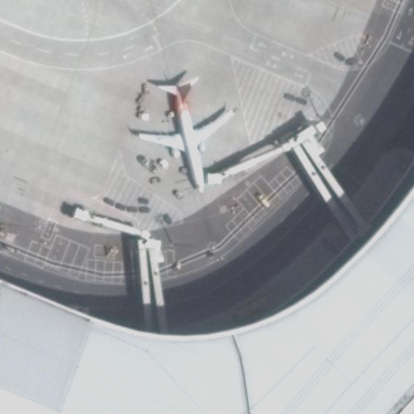
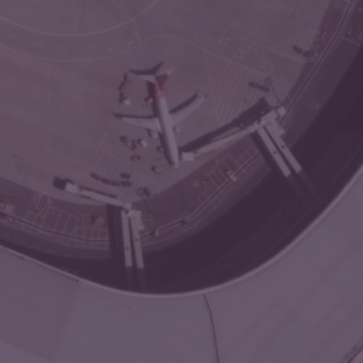
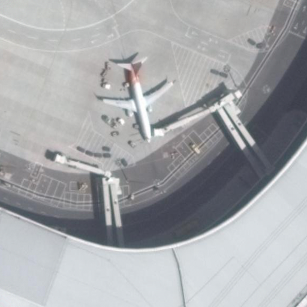

# Denoise 모듈

다양한 종류의 영상 노이즈를 제거하는 클래스를 포함하고 있습니다.

## 노이즈 제거 시각적 예시

각 노이즈가 제거된 후의 시각적 예시입니다.

### Atmospheric Denoise

`Py6S`로 산출한 Lp, HT 등을 사용해 노이즈 생성 수식의 역연산을 적용합니다.

### Gaussian Denoise

`cv2.GaussianBlur`를 사용해 가우시안 노이즈를 저감합니다.

### Missing Line Denoise

`skimage.restoration.inpaint_biharmonic`으로 라인 누락 영역을 보간합니다.

### Poisson Denoise

`cv2.medianBlur`로 샷 노이즈를 억제합니다.

### Salt & Pepper Denoise

`cv2.medianBlur`로 소금·후추 노이즈를 제거합니다.

### Striping Denoise

algotom 및 FFT 기반 억제 기법으로 줄무늬 노이즈를 제거합니다.

### Sun Angle Denoise

태양 고도에 따른 전역 조도 변화를 absolute correction으로 보정합니다.

### Terrain Denoise

Minnaert 보정으로 지형광 영향을 완화합니다.
[grass gis 공식문서](https://grass.osgeo.org/grass-stable/manuals/i.topo.corr.html), [geeguide](https://github.com/ndminhhus/geeguide/blob/master/04.topo_correction.md) 기반의 topo 보정 기능이 분기로 구현되어 있습니다.

### Vignetting Denoise

비네팅 마스크를 추정해 가장자리 어둡기를 보정합니다.
