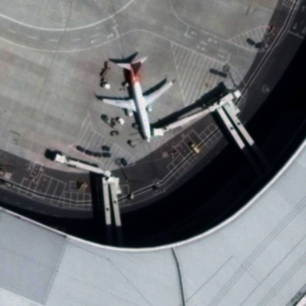
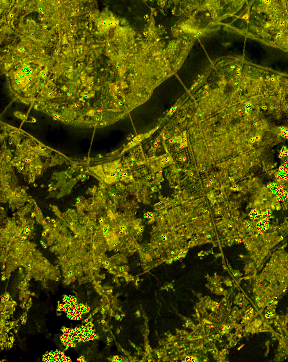
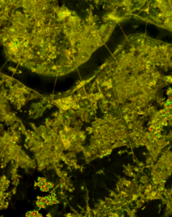
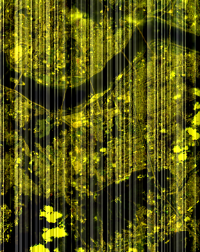
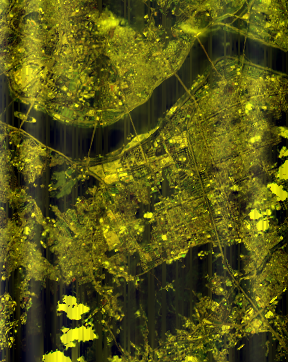
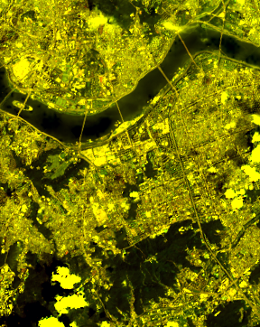
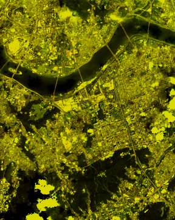
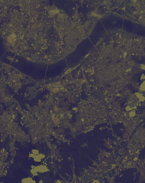
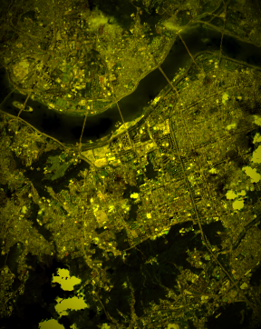

# Denoise 모듈

다양한 종류의 영상 노이즈를 제거하는 클래스를 포함하고 있습니다.

## 노이즈 제거 시각적 예시

각 노이즈가 제거된 후의 시각적 예시입니다.

### Atmospheric Denoise
| 적용 전 | 적용 후 |
| --- | --- |
|  |  |
`Py6S`로 산출한 Lp, HT 등을 사용해 노이즈 생성 수식의 역연산을 적용합니다.

- 지표(원본↔복원): SSIM=0.976, PSNR=39.93 dB, RMSE=2.57, MAE=2.09
- 참고(원본↔노이즈): SSIM=0.982, PSNR=42.13 dB, RMSE=2.00, MAE=1.60
- 개선(복원−노이즈): dSSIM=-0.006, dPSNR=-2.20 dB, dRMSE=-0.58, dMAE=-0.49

| 적용 전 | 적용 후 |
| --- | --- |
|  |  |

- 지표(원본↔복원): SSIM=0.369, PSNR=11.35 dB, RMSE=69.00, MAE=63.90
- 참고(원본↔노이즈): SSIM=0.260, PSNR=4.91 dB, RMSE=144.91, MAE=138.90

- Parameters (defaults): `factor=0.3`, `haze=True`, `rayleigh=True`, `yaml_name="KOMPSAT.yaml"`, `sun_angle=30`
- 파라미터 의미
  - factor: 대기 기여 강도 가정치(역연산 비중)
  - haze: 헤이즈 성분 고려 여부
  - rayleigh: 레일리 성분 고려 여부
  - yaml_name: 센서 보정/ESUN/게인/오프셋 설정 파일
  - sun_angle: 태양 고도각(도)
- 시각적 효과
  - 뿌연 정도 감소, 먼 풍경 선명·색상 향상
  - 하늘–지평선 경계 선명도 향상

### Gaussian Denoise
| 적용 전 | 적용 후 |
| --- | --- |
|  |  |
`cv2.GaussianBlur`를 사용해 가우시안 노이즈를 저감합니다.
  - 아주 작은 무늬는 조금 부드러워질 수 있으나 윤곽선은 비교적 유지됨

- 지표(원본↔복원): SSIM=0.851, PSNR=31.29 dB, RMSE=6.95, MAE=4.78
- 참고(원본↔노이즈): SSIM=0.587, PSNR=25.16 dB, RMSE=14.08, MAE=11.39
- 개선(복원−노이즈): dSSIM=0.264, dPSNR=6.14 dB, dRMSE=7.14, dMAE=6.61

| 적용 전 | 적용 후 |
| --- | --- |
|  |  |

- 지표(원본↔복원): SSIM=0.833, PSNR=30.18 dB, RMSE=7.90, MAE=5.27
- 참고(원본↔노이즈): SSIM=0.839, PSNR=32.03 dB, RMSE=6.38, MAE=4.86

### Missing Line Denoise
| 적용 전 | 적용 후 |
| --- | --- |
|  |  |
`skimage.restoration.inpaint_biharmonic`으로 라인 누락 영역을 보간합니다.

- 지표(원본↔복원): SSIM=0.999, PSNR=56.63 dB, RMSE=0.38, MAE=0.09
- 참고(원본↔노이즈): SSIM=0.847, PSNR=16.93 dB, RMSE=36.31, MAE=30.45
- 개선(복원−노이즈): dSSIM=0.152, dPSNR=39.70 dB, dRMSE=35.93, dMAE=30.36

| 적용 전 | 적용 후 |
| --- | --- |
|  |  |

- 지표(원본↔복원): SSIM=0.999, PSNR=45.87 dB, RMSE=1.30, MAE=0.13
- 참고(원본↔노이즈): SSIM=0.985, PSNR=31.88 dB, RMSE=6.50, MAE=0.41

### Poisson Denoise
| 적용 전 | 적용 후 |
| --- | --- |
|  |  |
`cv2.medianBlur`로 샷 노이즈를 억제합니다.

- 지표(원본↔복원): SSIM=0.747, PSNR=19.77 dB, RMSE=26.18, MAE=23.52
- 참고(원본↔노이즈): SSIM=0.949, PSNR=39.04 dB, RMSE=2.85, MAE=1.57
- 개선(복원−노이즈): dSSIM=-0.202, dPSNR=-19.27 dB, dRMSE=-23.34, dMAE=-21.95

| 적용 전 | 적용 후 |
| --- | --- |
|  |  |

- 지표(원본↔복원): SSIM=0.696, PSNR=24.30 dB, RMSE=15.54, MAE=9.09
- 참고(원본↔노이즈): SSIM=0.992, PSNR=40.90 dB, RMSE=2.30, MAE=0.81

### Salt & Pepper Denoise
| 적용 전 | 적용 후 |
| --- | --- |
|  |  |
`cv2.medianBlur`로 소금·후추 노이즈를 제거합니다.

- 지표(원본↔복원): SSIM=0.983, PSNR=39.77 dB, RMSE=2.62, MAE=1.85
- 참고(원본↔노이즈): SSIM=0.509, PSNR=16.22 dB, RMSE=39.41, MAE=31.66
- 개선(복원−노이즈): dSSIM=0.474, dPSNR=23.55 dB, dRMSE=36.80, dMAE=29.81

| 적용 전 | 적용 후 |
| --- | --- |
|  |  |

- 지표(원본↔복원): SSIM=0.859, PSNR=24.83 dB, RMSE=14.63, MAE=6.81
- 참고(원본↔노이즈): SSIM=0.754, PSNR=21.23 dB, RMSE=22.12, MAE=2.51

### Striping Denoise
| 적용 전 | 적용 후 |
| --- | --- |
|  |  |
algotom 및 FFT 기반 억제 기법으로 줄무늬 노이즈를 제거합니다.

- 지표(원본↔복원): SSIM=0.701, PSNR=25.63 dB, RMSE=13.34, MAE=10.27
- 참고(원본↔노이즈): SSIM=0.721, PSNR=28.82 dB, RMSE=9.24, MAE=7.58
- 개선(복원−노이즈): dSSIM=-0.020, dPSNR=-3.19 dB, dRMSE=-4.10, dMAE=-2.70

| 적용 전 | 적용 후 |
| --- | --- |
|  |  |

- 지표(원본↔복원): SSIM=0.862, PSNR=29.41 dB, RMSE=8.63, MAE=6.30
- 참고(원본↔노이즈): SSIM=0.879, PSNR=33.63 dB, RMSE=5.31, MAE=4.41

- Parameters (defaults): `size=5`, `level=7` (algotom wavelet-FFT)
- 파라미터 의미
  - size: 웨이블릿 기반 필터 크기(줄무늬 억제 강도에 영향)
  - level: 다중해상도 분해 레벨(구조적 줄무늬 성분 제거 깊이)

- 시각적 효과
  - 가로·세로 줄무늬가 줄어들어 배경이 고르게 보임
  - 밝고 어두운 경계 근처에 약한 줄 흔적이 남을 수 있음

### Sun Angle Denoise
| 적용 전 | 적용 후 |
| --- | --- |
|  |  |
태양 고도에 따른 전역 조도 변화를 absolute correction으로 보정합니다.

- 지표(원본↔복원): SSIM=0.807, PSNR=11.72 dB, RMSE=66.18, MAE=60.30
- 참고(원본↔노이즈): SSIM=0.808, PSNR=11.72 dB, RMSE=66.13, MAE=60.24
- 개선(복원−노이즈): dSSIM=-0.001, dPSNR=-0.01 dB, dRMSE=-0.05, dMAE=-0.07

| 적용 전 | 적용 후 |
| --- | --- |
|  |  |

- 지표(원본↔복원): SSIM=0.947, PSNR=24.70 dB, RMSE=14.85, MAE=10.55
- 참고(원본↔노이즈): SSIM=0.934, PSNR=18.72 dB, RMSE=29.56, MAE=20.50

- Parameters (defaults): `sunAngle=45`, `intensity=0.5`, `gamma=1.0`
- 파라미터 의미
  - sunAngle: 태양 고도각(도). sin(sunAngle)을 이용해 보정 스케일 산정
  - intensity: 각도 기반 보정 스케일의 가중치(0~1)
  - gamma: 감마 지수(비선형 보정 강도 제어)

- 시각적 효과
  - 화면 전체의 밝기 차이가 줄어 더 고르게 보임
  - 너무 밝거나 너무 어두운 부분의 쏠림이 완화됨

### Terrain Denoise
| 적용 전 | 적용 후 |
| --- | --- |
|  |  |
Minnaert 보정으로 지형광 영향을 완화합니다.
[grass gis 공식문서](https://grass.osgeo.org/grass-stable/manuals/i.topo.corr.html), [geeguide](https://github.com/ndminhhus/geeguide/blob/master/04.topo_correction.md) 기반의 topo 보정 기능이 분기로 구현되어 있습니다.

- 지표(원본↔복원): SSIM=0.392, PSNR=5.86 dB, RMSE=129.90, MAE=116.34
- 참고(원본↔노이즈): SSIM=0.761, PSNR=10.09 dB, RMSE=79.78, MAE=71.48
- 개선(복원−노이즈): dSSIM=-0.369, dPSNR=-4.23 dB, dRMSE=-50.12, dMAE=-44.86

| 적용 전 | 적용 후 |
| --- | --- |
|  |  |

- 지표(원본↔복원): SSIM=0.371, PSNR=13.71 dB, RMSE=52.59, MAE=44.98
- 참고(원본↔노이즈): SSIM=0.378, PSNR=13.71 dB, RMSE=52.63, MAE=44.98

- Parameters: `DEM=None`, `sun_azimuth=225`, `sun_elevation=45`, `method="minnaert"`, `mode="luminance"`, `scale_clip=(0.8, 1.2)`, `shadow_thresh=0.2`, `robust=True`, `ransac_iter=300`, `inlier_sigma=2.0`
- Defaults: `eps=1e-3`, `sample_max=200000`, `mode="luminance"`, `method="c"`, `scale_clip=(0.5, 1.5)`, `shadow_thresh=0.2`, `robust=True`, `ransac_iter=200`, `inlier_sigma=2.5`

참고: 비-topo 경로(`terrain(...)`)는 Minnaert 파라미터 기반 보정을 수행하며, 본 샘플에서는 `terrainTopo(...)`만 사용했습니다.

- 파라미터 의미
  - DEM: 지형 경사/입사각 계산에 사용하는 고도 격자
  - sun_azimuth/sun_elevation: 태양 방위/고도(도). 입사각 산정에 사용
  - method: 보정 방식 선택(예: c-correction, minnaert)
  - mode: 스케일 추정 기준(luminance 기반 또는 channel)
  - scale_clip: 보정 스케일 하한/상한(과보정을 방지)
  - shadow_thresh: 그림자(낮은 입사각) 보호 임계값
  - robust: RANSAC 등 강건 회귀 사용 여부
  - ransac_iter: RANSAC 반복 횟수(표본 추출 횟수)
  - inlier_sigma: 인라이어 판정 기준(표준편차 배수)

- 시각적 효과
  - 산면·경사면의 밝기 차이가 줄어 색과 밝기가 더 균일해 보임
  - 그늘진 부분의 색 번짐이나 뭉개짐이 완화됨

### Vignetting Denoise
| 적용 전 | 적용 후 |
| --- | --- |
|  |  |
비네팅 마스크를 추정해 가장자리 어둡기를 보정합니다.

- 지표(원본↔복원): SSIM=0.995, PSNR=49.29 dB, RMSE=0.87, MAE=0.40
- 참고(원본↔노이즈): SSIM=0.830, PSNR=13.23 dB, RMSE=55.60, MAE=44.21
- 개선(복원−노이즈): dSSIM=0.166, dPSNR=36.06 dB, dRMSE=54.72, dMAE=43.81

| 적용 전 | 적용 후 |
| --- | --- |
|  |  |

- 지표(원본↔복원): SSIM=0.961, PSNR=45.77 dB, RMSE=1.31, MAE=1.21
- 참고(원본↔노이즈): SSIM=0.879, PSNR=19.60 dB, RMSE=26.71, MAE=15.17

- Parameters (defaults): `strength=0.4`, `power=2.3`
- 파라미터 의미
  - strength: 중심 대비 가장자리 감쇠 보정 강도(나눗셈 보정의 세기)
  - power: 반경에 대한 지수(보정 변화의 기울기)

- 시각적 효과
  - 화면 모서리 밝기가 올라가 중앙과 비슷해 보임
  - 모서리에서는 잡음이 조금 더 눈에 띌 수 있음
