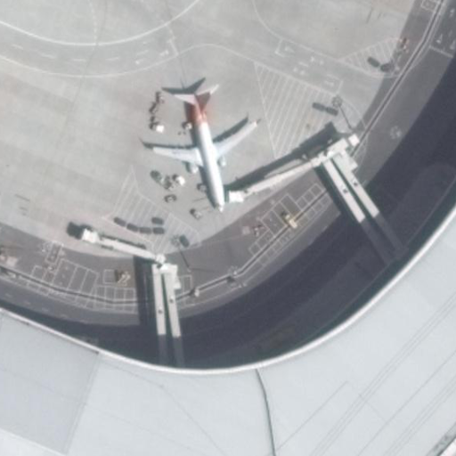
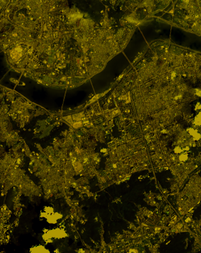
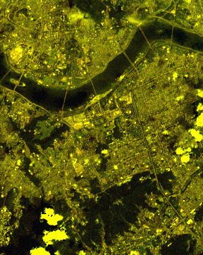

# Noise Generator 모듈

다양한 종류의 영상 노이즈를 생성하는 클래스를 포함하고 있습니다.

## 노이즈별 시각적 예시

샘플 이미지에 각 노이즈가 적용된 시각적 예시입니다.

### Atmospheric Noise
| 적용 전 | 적용 후 |
| --- | --- |
|  |  |
Ls = H · ρ · T + Lp에서 H(total downwelling radiance)는 reflectance, radiance 변환식을 사용하고, T와 Lp는 Py6S로 계산해 선형 보간 형태로 구현합니다.

 - 지표(원본↔노이즈)
   - SSIM=0.985, PSNR=44.28 dB, RMSE=1.56, MAE=1.25

| 적용 전 | 적용 후 |
| --- | --- |
|  |  |

 - 지표(원본↔노이즈)
   - SSIM=0.378, PSNR=13.71 dB, RMSE=52.63, MAE=44.98

 - Parameters: `factor=0.7`, `haze=True`, `rayleigh=True`, `yaml_name="KOMPSAT.yaml"`, `sun_angle=30`
 - Defaults: `factor=0.1`, `haze=True`, `rayleigh=True`, `yaml_name="KOMPSAT.yaml"`, `sun_angle=30`
 - 파라미터 의미
   - factor: 원본과 대기 효과 결과의 혼합 비율(1에 가까울수록 효과 증가)
   - haze: 안개/먼지 등 흐림 성분 적용 여부
   - rayleigh: 맑은 공기 분산 성분 적용 여부
   - yaml_name: 센서별 보정 상수/ESUN/게인/오프셋 설정 파일명
   - sun_angle: 해의 높이(도). 낮을수록 대기 영향 증가
 - 시각적 효과
   - 화면이 회색 베일처럼 뿌옇게 보임
   - 먼 풍경 선명도와 색이 저하됨

### Gaussian Noise
| 적용 전 | 적용 후 |
| --- | --- |
|  |  |
이미지 전체에 정규 분포(가우시안 분포)를 따르는 랜덤 노이즈를 추가합니다.

 - 지표(원본↔노이즈)
   - SSIM=0.587, PSNR=25.16 dB, RMSE=14.08, MAE=11.39

| 적용 전 | 적용 후 |
| --- | --- |
|  |  |

 - 지표(원본↔노이즈)
   - SSIM=0.839, PSNR=32.03 dB, RMSE=6.38, MAE=4.86
 - Parameters: (default)
 - Defaults: `mean=0`, `var=50`
 - 파라미터 의미
   - mean: 노이즈 평균값
   - var: 분산(σ²). σ = sqrt(var)
 - 시각적 효과
   - 화면 전반에 고르게 작은 점 잡음이 섞여 거칠게 보임

### Missing Line Noise
| 적용 전 | 적용 후 |
| --- | --- |
|  |  |
특정 행/열을 0으로 만들어 노이즈를 구현합니다.

 - 지표(원본↔노이즈)
   - SSIM=0.847, PSNR=16.93 dB, RMSE=36.31, MAE=30.45

| 적용 전 | 적용 후 |
| --- | --- |
|  |  |

 - 지표(원본↔노이즈)
   - SSIM=0.985, PSNR=31.88 dB, RMSE=6.50, MAE=0.41
 - Parameters: (default)
 - Defaults: `num_threshold=10`, `len_threshold=512`
 - 파라미터 의미
   - num_threshold: 결손 처리할 행의 최대 개수
   - len_threshold: 결손 구간 최대 길이(픽셀)
   - 시작 위치: 결손 시작 열을 무작위 선택
 - 시각적 효과
   - 가로줄 일부가 사라져 검은 빈 칸 또는 끊김이 생김

### Poisson Noise
| 적용 전 | 적용 후 |
| --- | --- |
|  |  |
신호 강도에 따라 노이즈가 달라지는 푸아송 노이즈를 추가합니다.

 - 지표(원본↔노이즈)
   - SSIM=0.949, PSNR=39.04 dB, RMSE=2.85, MAE=1.57

| 적용 전 | 적용 후 |
| --- | --- |
|  |  |

 - 지표(원본↔노이즈)
   - SSIM=0.992, PSNR=40.90 dB, RMSE=2.30, MAE=0.81
 - Parameters: (default)
 - Defaults: `factor=0.1`
 - 파라미터 의미
   - factor: 원본과 푸아송 샘플 이미지를 혼합하는 비율(강도 제어)
 - 시각적 효과
   - 밝은 영역에서 작은 점 형태 잡음이 더 눈에 띔

### Salt & Pepper Noise
| 적용 전 | 적용 후 |
| --- | --- |
|  |  |
일부 픽셀을 0 또는 255로 치환하는 소금·후추 노이즈를 적용합니다.

 - 지표(원본↔노이즈)
   - SSIM=0.509, PSNR=16.22 dB, RMSE=39.41, MAE=31.66

| 적용 전 | 적용 후 |
| --- | --- |
|  |  |

 - 지표(원본↔노이즈)
   - SSIM=0.754, PSNR=21.23 dB, RMSE=22.12, MAE=2.51
 - Parameters: (default)
 - Defaults: `s_vs_p=0.5`, `amount=0.02`
 - 파라미터 의미
   - s_vs_p: 흰점(255) 대비 검은점(0)의 비율(0~1)
   - amount: 점으로 치환될 픽셀 비율(0~1)
 - 시각적 효과
   - 화면 곳곳에 검은 점과 하얀 점이 보임

### Striping Noise
| 적용 전 | 적용 후 |
| --- | --- |
|  |  |
사인파 패턴을 더해 가로/세로 줄무늬를 만듭니다.

 - 지표(원본↔노이즈)
   - SSIM=0.721, PSNR=28.82 dB, RMSE=9.24, MAE=7.58

| 적용 전 | 적용 후 |
| --- | --- |
|  |  |

 - 지표(원본↔노이즈)
   - SSIM=0.879, PSNR=33.63 dB, RMSE=5.31, MAE=4.41
 - Parameters: (default)
 - Defaults: `noise_strength=10`, `stripe_width=2`, `direction="horizontal"`
 - 파라미터 의미
   - noise_strength: 줄무늬 밝기 변화 크기
   - stripe_width: 줄무늬 두께(픽셀)
   - direction: 줄무늬 방향(가로/세로)
 - 시각적 효과
   - 화면에 가로줄 또는 세로줄이 반복되어 줄무늬가 생김

### Sun Angle Noise
| 적용 전 | 적용 후 |
| --- | --- |
|  |  |
감마 보정과 태양 고도각을 이용해 전역 조도 변화를 시뮬레이션합니다.

 - 지표(원본↔노이즈)
   - SSIM=0.808, PSNR=11.72 dB, RMSE=66.13, MAE=60.24

| 적용 전 | 적용 후 |
| --- | --- |
|  |  |

 - 지표(원본↔노이즈)
   - SSIM=0.934, PSNR=18.72 dB, RMSE=29.56, MAE=20.50
 - Parameters: `intensity=1.0` (others default)
 - Defaults: `angle=45`, `intensity=0.5`, `gamma=1.0`
 - 파라미터 의미
   - angle: 태양 고도각(도)
   - intensity: 밝기 변화 강도
   - gamma: 변화 속도(감마)
 - 시각적 효과
   - 사진 전체 노출이 달라져 밝아지거나 어두워짐

### Terrain Noise
| 적용 전 | 적용 후 |
| --- | --- |
|  |  |
Minnaert 역연산 기반으로 구현되며, DEM 입력 시 경사/입사각을 반영합니다.

 - 지표(원본↔노이즈)
   - SSIM=0.761, PSNR=10.09 dB, RMSE=79.78, MAE=71.48

| 적용 전 | 적용 후 |
| --- | --- |
|  |  |

 - 지표(원본↔노이즈)
   - SSIM=0.378, PSNR=13.71 dB, RMSE=52.63, MAE=44.98
 - Parameters: `factor=0.7`, `DEM=None`
 - Defaults: `pixel_size=1.0`, `sun_angle=30`, `sun_azimuth=225`, `sun_elevation=45`, `slope=30`, `max_slope=45`, `Minnaert_constant_NIR=0.6`, `Minnaert_constant_R=0.5`, `Minnaert_constant_G=0.4`, `Minnaert_constant_B=0.3`, `yaml_name="KOMPSAT.yaml"`
 - 파라미터 의미
   - factor: 원본과 지형 효과 이미지를 섞는 비율
   - DEM: 높이 지도(지형 기복에 따른 밝기 차이를 반영)
   - pixel_size: DEM 픽셀 간격
   - sun_angle/sun_azimuth/sun_elevation: 태양 위치(도)
   - slope: DEM 없을 때 가정하는 경사(도)
   - max_slope: 과도한 경사 제한 상한
   - Minnaert_constant_*: 경사에 따른 밝기 변화 민감도(밴드별)
   - yaml_name: 센서 보정 상수/ESUN/게인/오프셋 설정 파일
 - 시각적 효과
   - 경사면에 따라 밝고 어두운 부분이 생겨 입체감이 강조됨

 - 파라미터 의미
   - factor: 원본과 지형광 보정 역연산 결과의 혼합 비율
   - DEM: 지형 경사 및 입사각 계산에 사용하는 고도 격자. 미지정 시 고정 slope 사용
   - pixel_size: DEM 픽셀 해상도(지상 해상도). 내부 구현에서 경사 계산에 사용 가능
   - sun_angle/sun_azimuth/sun_elevation: 태양 위치 파라미터(도). 입사각 산정에 사용
   - slope: DEM 미제공 시 사용하는 고정 경사(도)
   - max_slope: 경사 상한. 과도한 보정 방지용
   - Minnaert_constant_*: Minnaert k 상수(밝기-입사각 감도)로 밴드별 광도 의존성을 제어
   - yaml_name: 센서별 radiance<->DN 변환과 ESUN 등 보정 상수 정의 파일명

### Vignetting Noise
| 적용 전 | 적용 후 |
| --- | --- |
|  |  |
중앙부 대비 주변부가 어두워지는 비네팅 효과를 시뮬레이션합니다.

 - Parameters: (default)
 - Defaults: `strength=0.4`, `power=2.3`

 - 파라미터 의미
   - strength: 모서리를 얼마나 어둡게 할지 정도
   - power: 가장자리로 갈수록 어두워지는 속도

 - 시각적 효과
  - 화면 가장자리가 어두워지고 가운데가 상대적으로 밝아 보임

 - 지표(원본↔노이즈)
   - SSIM=0.830, PSNR=13.23 dB, RMSE=55.60, MAE=44.21

| 적용 전 | 적용 후 |
| --- | --- |
|  |  |

 - 지표(원본↔노이즈)
   - SSIM=0.879, PSNR=19.60 dB, RMSE=26.71, MAE=15.17

 - 파라미터 의미
   - strength: 중심 대비 가장자리 감쇠 강도(0~1). 값이 클수록 가장자리가 더 어두워짐
   - power: 반경(중심으로부터 거리)에 대한 지수. 값이 클수록 감쇠가 급격해짐
