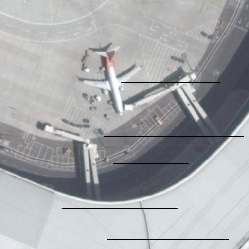
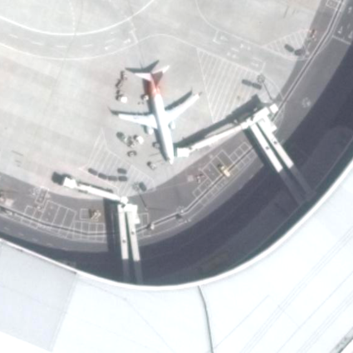
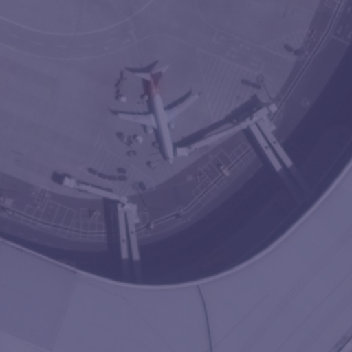

# Noise Generator 모듈

다양한 종류의 영상 노이즈를 생성하는 클래스를 포함하고 있습니다.

## 노이즈별 시각적 예시

샘플 이미지에 각 노이즈가 적용된 시각적 예시입니다.

### Atmospheric Noise
Ls = H * ρ * T + Lp 에서의 H(total downwelling된 radiance)를 reflectance를 구하는 수식인 (pi * radiance * d^2) / (ESUN * sinθ)의 역연산을 통해 구하고, T값과 Lp값은 py6s를 통해 계산하는 방식으로 역연산하여 구현됩니다.

### Gaussian Noise
이미지 전체에 정규 분포(가우시안 분포)를 따르는 랜덤 노이즈를 추가합니다.

### Missing Line Noise
이미지의 특정 행 또는 열을 검은색(0)으로 만들어, 센서 일부가 동작하지 않은 듯한 누락된 라인 형태의 노이즈를 시뮬레이션합니다.

### Poisson Noise
신호의 강도에 따라 노이즈의 양이 달라지는 푸아송 분포를 따르는 노이즈를 추가합니다. 주로 광량이 부족할 때 발생하는 샷 노이즈(shot noise)를 모델링합니다.

### Salt & Pepper Noise
이미지의 일부 픽셀을 무작위로 순수한 검은색(0, salt) 또는 흰색(255, pepper)으로 바꾸는 노이즈입니다.

### Striping Noise
이미지에 주기적인 사인파 형태의 값을 더하여, 가로 또는 세로 방향의 줄무늬 노이즈를 생성합니다.

### Sun Angle Noise
감마 보정(gamma correction)을 이용하여 태양 고도각의 변화에 따른 조도 변화를 시뮬레이션합니다.

### Terrain Noise
Minnaert 연산의 역연산을 취하는 방식으로 구현됩니다. DEM을 입력받은 경우는 slope를 계산하여 mask를 factor만큼 적용합니다.

### Vignetting Noise
렌즈의 광학적 특성으로 인해 이미지의 중앙부보다 주변부가 어두워지는 비네팅 효과를 시뮬레이션합니다.

